# 🏛️ NYAY SURAKSHA — COMPLETE SYSTEM DESIGN

## Problem Statement: SIH26190 — Secure Digital Document Management System for Legal & Investigation Documents
## System Name: न्याय सुरक्षा (Nyay Suraksha)

---

## 1. HIGH-LEVEL ARCHITECTURE (HLA)

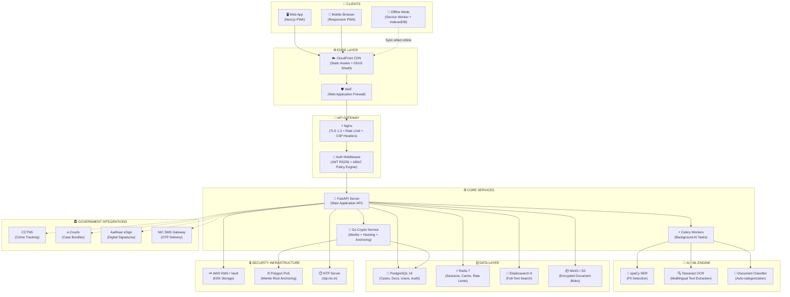

---

## 2. MICROSERVICES COMPONENT MAP

```mermaid
graph LR
    subgraph FRONTEND["FRONTEND SERVICE (Next.js)"]
        direction TB
        F1["Auth Pages<br/>(Login + MFA)"]
        F2["Case Dashboard"]
        F3["Document Manager"]
        F4["Secure Viewer<br/>(Watermarked)"]
        F5["Redaction Review UI"]
        F6["Analytics Dashboard<br/>(India Map + Charts)"]
        F7["Admin Panel"]
        F8["Role Switcher"]
    end

    subgraph BACKEND["MAIN API SERVICE (Python FastAPI)"]
        direction TB
        B1["Auth Router<br/>(/api/v1/auth)"]
        B2["Cases Router<br/>(/api/v1/cases)"]
        B3["Documents Router<br/>(/api/v1/documents)"]
        B4["Redaction Router<br/>(/api/v1/redaction)"]
        B5["Analytics Router<br/>(/api/v1/analytics)"]
        B6["Admin Router<br/>(/api/v1/admin)"]
        B7["Cert Generator<br/>(/api/v1/certs)"]
    end

    subgraph CRYPTO["CRYPTO SERVICE (Go)"]
        direction TB
        C1["SHA-256 Hasher"]
        C2["Merkle Tree Engine"]
        C3["Proof Generator"]
        C4["Polygon Anchor"]
        C5["Integrity Verifier"]
    end

    subgraph WORKERS["AI WORKERS (Celery)"]
        direction TB
        W1["OCR Worker"]
        W2["NER Worker"]
        W3["Classification Worker"]
        W4["Malware Scan Worker"]
    end

    FRONTEND -->|"REST API (HTTPS)"| BACKEND
    BACKEND -->|"gRPC / REST"| CRYPTO
    BACKEND -->|"Redis Queue"| WORKERS
```

---

## 3. DATA FLOW DIAGRAMS

### 3.1 Document Upload Flow (Critical Path)

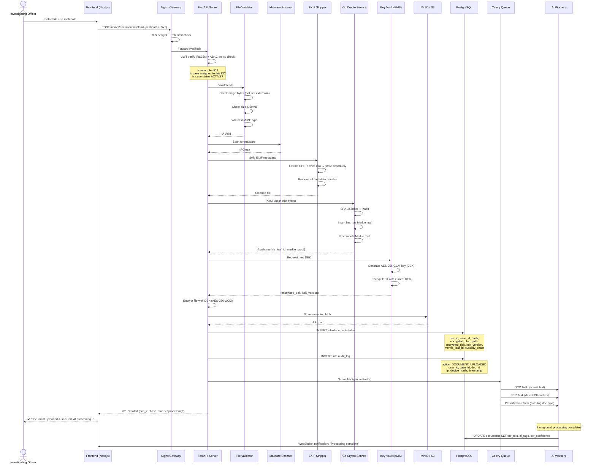

### 3.2 Document Verification Flow (Tamper Detection)

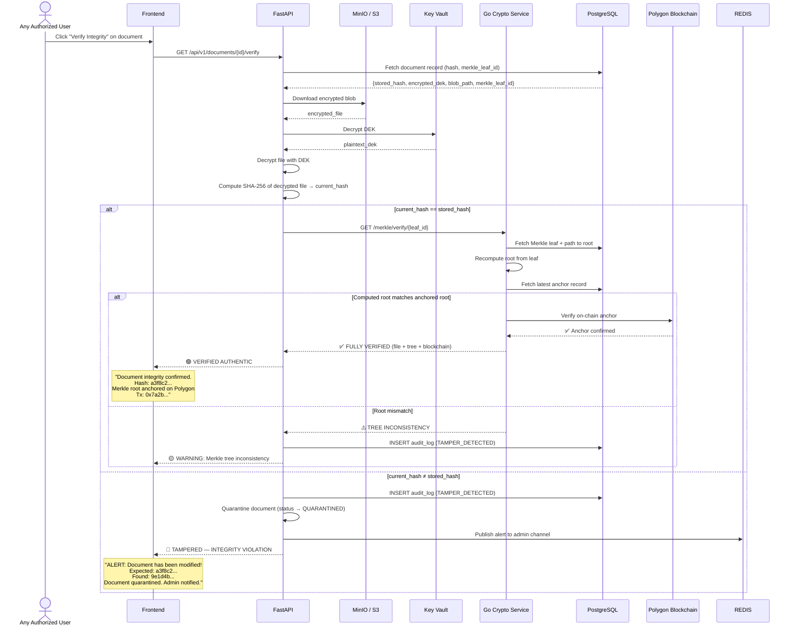

### 3.3 AI Redaction Flow (Women Safety / POCSO)

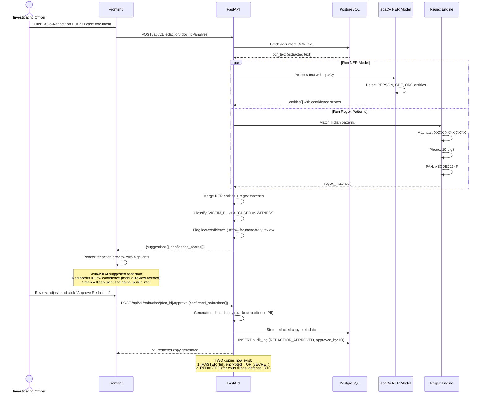

### 3.4 Multi-Agency Document Transfer Flow

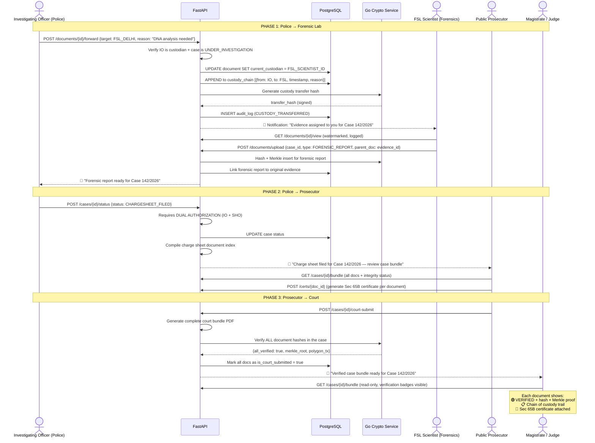

### 3.5 BSA 2023 / Sec 65B Certificate Generation Flow

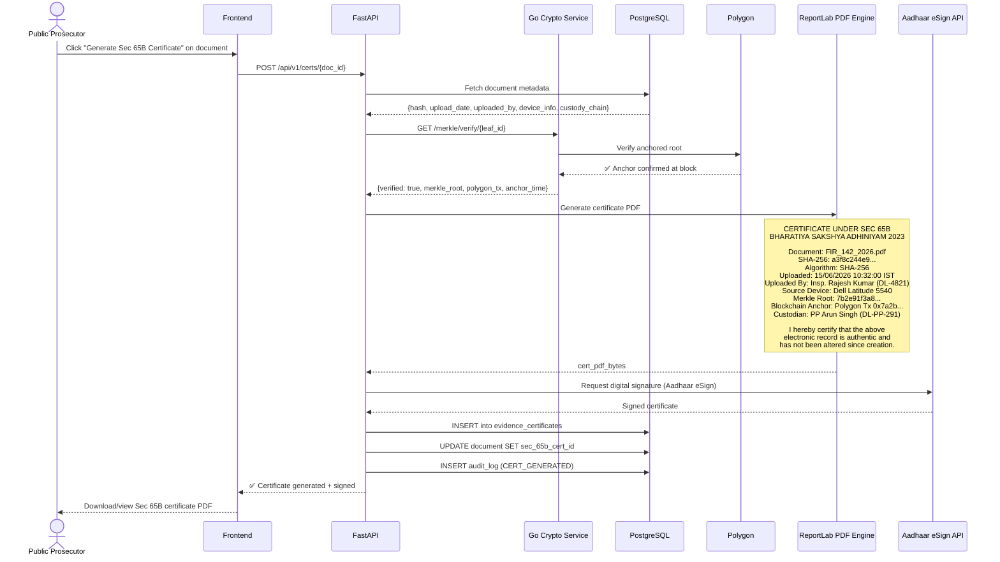

---

## 4. DATABASE ENTITY-RELATIONSHIP DIAGRAM

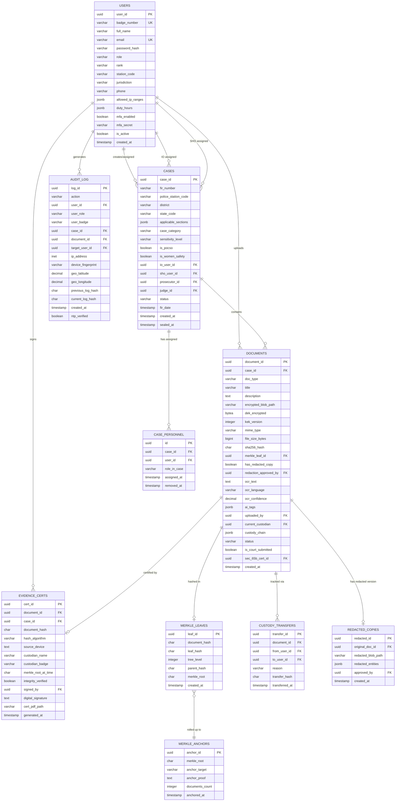

---

## 5. AUTHENTICATION & AUTHORIZATION SEQUENCE

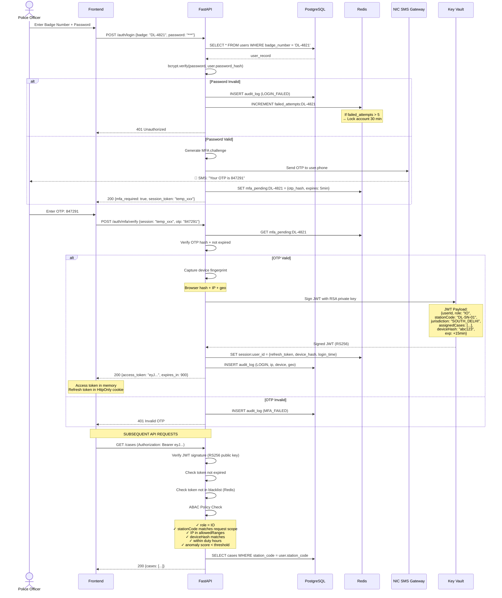

---

## 6. CACHING & PERFORMANCE ARCHITECTURE

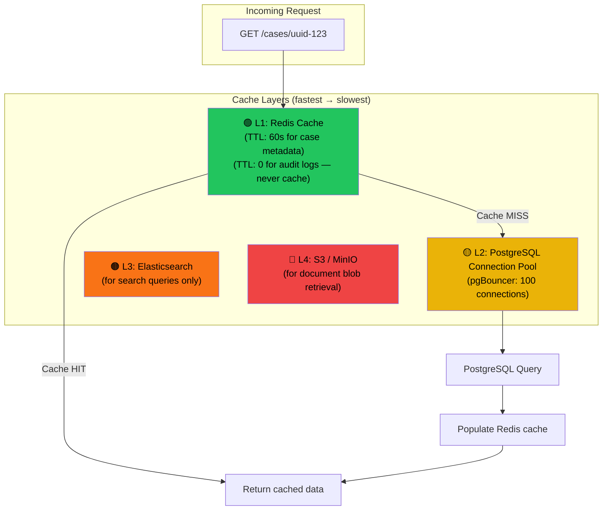

### What Gets Cached vs What NEVER Gets Cached

| Data | Cached? | TTL | Reason |
|---|---|---|---|
| Case metadata (title, status, station) | ✅ Redis | 60 seconds | Read-heavy, changes rarely |
| Document metadata (title, hash, type) | ✅ Redis | 60 seconds | Read-heavy |
| User profile + role | ✅ Redis | 5 minutes | Rarely changes |
| JWT blacklist | ✅ Redis | Token expiry time | Must be instant |
| Rate limit counters | ✅ Redis | Per window (1 min) | Must be fast |
| **Audit logs** | ❌ NEVER | — | Security critical — always read from DB |
| **Document content (blobs)** | ❌ NEVER | — | Too large + must be decrypted per-request |
| **Merkle proofs** | ❌ NEVER | — | Must be computed fresh for verification |

---

## 7. MESSAGE QUEUE & BACKGROUND TASK ARCHITECTURE

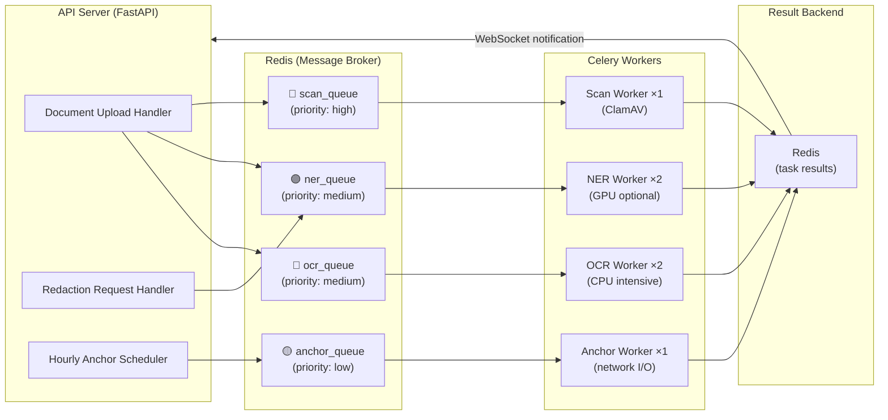

---

## 8. OFFLINE-FIRST PWA SYNC STRATEGY

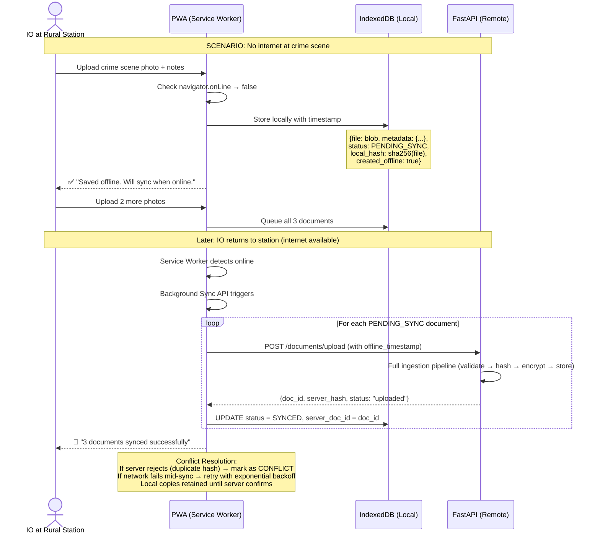

---

## 9. SECURITY THREAT MODEL

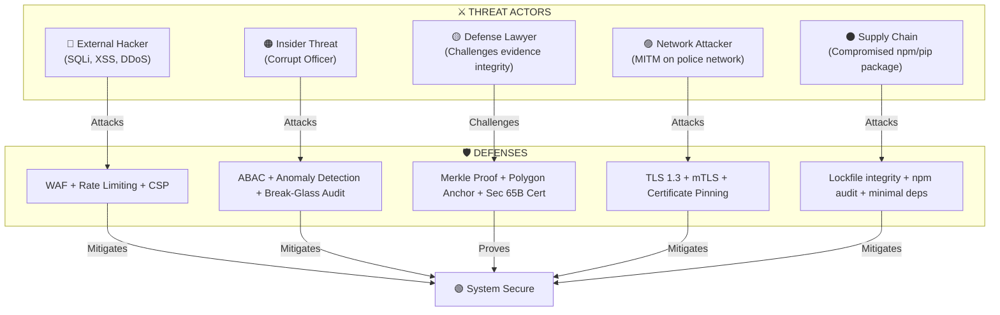

---

## 10. DEPLOYMENT & DISASTER RECOVERY

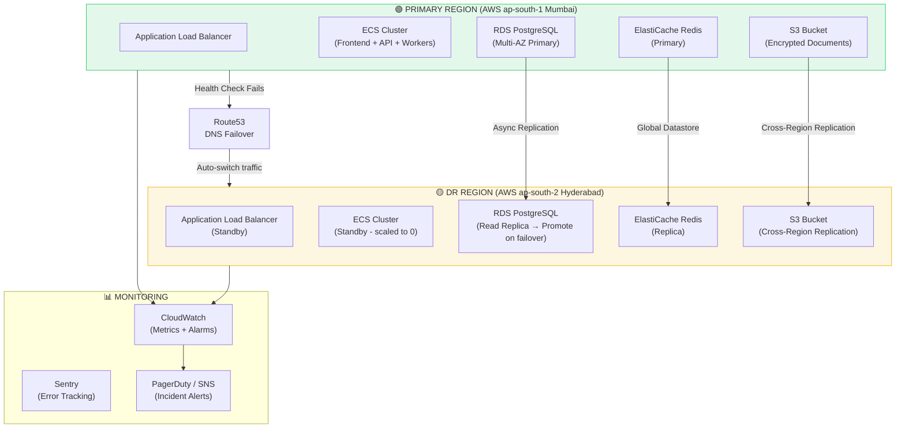

### Recovery Objectives

| Metric | Target | Method |
|---|---|---|
| **RPO (Recovery Point Objective)** | ≤ 1 hour | Async DB replication + S3 cross-region sync |
| **RTO (Recovery Time Objective)** | ≤ 4 hours | DNS failover + promote read replica + scale ECS |
| **Backup Frequency** | Every 6 hours | Automated RDS snapshots + S3 versioning |
| **Backup Retention** | 90 days (CERT-In: 180 days for logs) | Lifecycle policies with Glacier archival |
| **Backup Encryption** | AES-256 with separate backup KEK | AWS KMS with cross-account key |

---

## 11. MONITORING & OBSERVABILITY

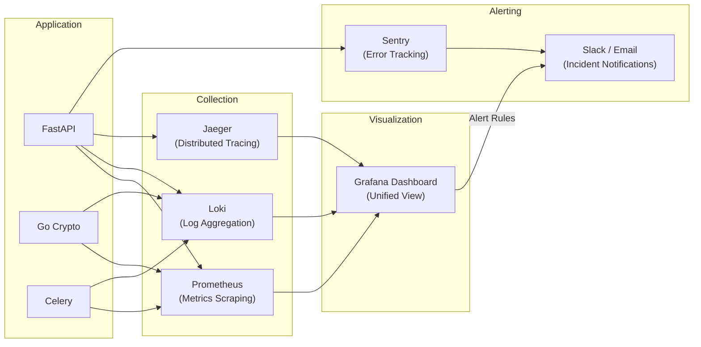

### Key Metrics to Track

| Metric | Source | Alert Threshold |
|---|---|---|
| API response time (p95) | Prometheus | > 500ms |
| Failed login attempts per user | Redis counter | > 5 in 10 min |
| Document integrity check failures | Audit log | Any occurrence |
| Celery task queue depth | Prometheus | > 100 pending |
| Database connection pool usage | pgBouncer | > 80% |
| S3 storage usage | CloudWatch | > 80% capacity |
| Anomalous access patterns | Custom detector | Score > threshold |

---

> [!IMPORTANT]
> This system design covers every component, every data flow, every security layer, and every failure scenario. Review the diagrams and flows — once approved, we begin scaffolding code in your workspace.
